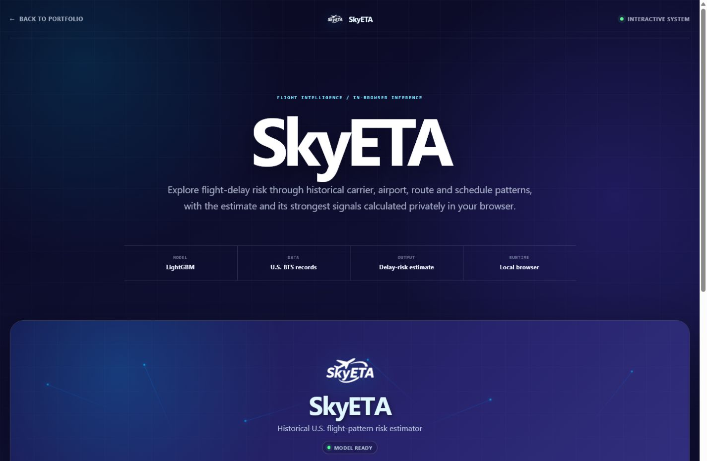
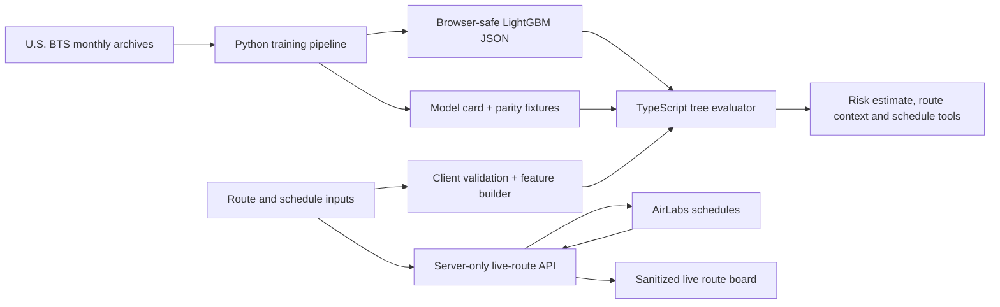

# SkyETA

SkyETA is a browser-based flight-delay risk instrument by Peters Elijah
Temidayo. It evaluates a real exported LightGBM model locally in the visitor's
browser, explains the strongest route and schedule signals, and can add a
separate live route board through a server-side AirLabs integration.



## What it demonstrates

- Reproducible model training from official U.S. Bureau of Transportation
  Statistics records.
- Leakage-conscious chronological evaluation and browser/Python parity checks.
- Local TypeScript tree evaluation: flight inputs and model inference stay in
  the browser.
- Deterministic route context and schedule-sensitivity tools.
- A defensive live-flight API that validates queries, limits fields, sanitizes
  responses, caches briefly and never exposes the provider key.
- Explicit empty, unavailable and unconfigured states—no invented live flights.

## Architecture



The model estimate and the live route board are deliberately separate. The
first is a historical-pattern estimate; the second is current provider data.

## Run locally

Requirements: Node.js 22.13 or newer. The live route board is optional.

```bash
npm ci
npm run dev
```

Open the local URL printed by the development server.

To enable current AirLabs schedule/status rows, copy `.env.example` to
`.env.local` and set `AIRLABS_API_KEY`. The key is read only by the server
route. Without it, model inference still works and the live panel clearly says
that it is not configured.

Production-style local run:

```bash
npm run build
npm start
```

The default production port is `4177`; override it with `PORT` in
`.env.local` when needed.

## Verify the application

```bash
npm test
npm run build
```

The JavaScript tests verify exported-model parity and the live API's validation,
sanitization, timeout, cache and no-key behavior.

## Reproduce the model

The model pipeline lives in [`skyeta-ml`](skyeta-ml). Raw downloads, virtual
environments and local joblib artifacts are intentionally ignored.

Windows PowerShell:

```powershell
python -m venv skyeta-ml/.venv
skyeta-ml/.venv/Scripts/python -m pip install -r skyeta-ml/requirements.txt
skyeta-ml/.venv/Scripts/python skyeta-ml/download_bts.py
skyeta-ml/.venv/Scripts/python skyeta-ml/train.py
```

macOS/Linux uses `skyeta-ml/.venv/bin/python` instead. See
[`skyeta-ml/README.md`](skyeta-ml/README.md) for feature contracts, evaluation
policy and export commands; see [`skyeta-ml/WEATHER.md`](skyeta-ml/WEATHER.md)
for the timestamp-safe weather research path.

## Repository map

| Path | Purpose |
| --- | --- |
| `app/components/SkyetaDemo.tsx` | Local inference, review and live-board UI |
| `app/api/skyeta/live-flights/` | Server-only AirLabs adapter |
| `public/assets/skyeta-model.json` | Browser-safe exported model |
| `public/assets/skyeta-model-card.json` | Provenance and evaluation record |
| `skyeta-ml/` | Download, feature engineering, training and tests |
| `tests/` | Browser-model and API contract tests |
| `docs/screenshots/` | Verified desktop/mobile reference captures |

## Limitations

- SkyETA estimates historical delay risk; it is not a guarantee, operational
  flight status, booking availability or travel advice.
- The exported public model covers completed U.S. domestic flights represented
  by its BTS source period. It should not be generalized to other markets.
- Weather, aircraft rotation, crew constraints and live disruption signals are
  not inputs to the shipped browser model.
- Current schedule/status rows require a valid AirLabs key and provider
  coverage. The UI never fabricates a fallback.
- The schedule-sensitivity panel evaluates hypothetical model inputs; those
  rows are not bookable flight options.

## License

MIT. See [`LICENSE`](LICENSE).
